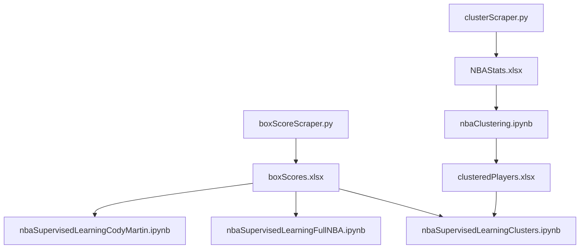

# **NBA_Machine_Learning**


## This repository will contain work towards a ML model designed to predit NBA player statistics. Most of the work will be done in the scripts directory.


```**\scripts\unsupervisedLearningIntro.ipynb:**```

This notebook contains an introduction to unsupervised learning. It covers the KMeans algorithm and basic clustering. It has no relevance to the NBA beyond serving as an introduction to the techniques used in the project.

```**\scripts\clusterScraper.py:**```

This script scrapes the NBA website for various player statistics and stores them in a pandas dataframe. No clustering occurs here, it is rather a data collection tool which gathers every player's statistics for a given season. This data is then fed into \scripts\nbaClustering.ipynb where the player archetype clusters can be formed

```**\scripts\boxScoreScraper.py:**```
This script scrapes the NBA website for all the box scores for each player in a given season. It stores the data in a pandas dataframe. The data is saved to data/boxScores.xlsx, along with some computations regarding fantasy points. This data is used in the Supervised Learning Files.


```\scripts\nbaClustering.ipynb:```

This notebook contains the code to cluster NBA players into archetypes. It uses the data collected by \scripts\clusterScraper.py in \data\NBAStats.xlsx to form the clusters. A number of factors go into deciding the number of clusters. Ideal clusters are determined by balancing a high PCA Variance Ratio with a low rate of change in the Variance Ratio (e.g., using the elbow method) and a relatively high silhouette score. By using both criteria, you balance data representativeness (high variance ratio) and computational efficiency (low derivative). The clusters are formed using the KMeans algorithm and dimensions are reduced using PCA. The resulting clusters correspond to player archetypes which are used in future analysis. These cluster assignments are stored within /data/clusteredPlayers.xlsx. Visualizations of the data are included in the ```images``` directory.


```\scripts\nbaSupervisedLearningCodyMartin.ipynb:```

This notebook contains the code to create a ML model based only on Cody Martin's statistics. A decision tree is created based on his prior FP outputs which are extracted from \data\boxScores.xlsx. A random forest model is then used, which contains many different decision trees. This model performed better than a single decision tree, as expected. The mean error serves as a good way to test model accuracy.

```scripts\nbaSupervisedLearningFullNBA.ipynb:```
 
Decision Tree and random forest for the full nba dataset. This model is trained on all players in the NBA, not just Cody Martin. The model is trained on the same data as the Cody Martin model, but with more data. The model is then tested on the same data as the Cody Martin model. The mean error serves as a good way to test model accuracy.

```scripts\nbaSupervisedLearningClusters.ipynb:```
Decision Tree and random forest for each cluster, which has been calculated before. Each cluster has about 500 games played. The model is trained and tested on the same data as the full NBA model. The mean error serves as a good way to test model accuracy. Right now, the clusters are performing worse than the full NBA model which should not be the case.


# Thoughts on high clustering errors:
* The issue is that I am getting an average of 6 for error when fantasy is only 20-30. This is a huge error. It is barely better than avg_dif from mean and is slightly worse than trianing based on the whole NBA.
* Could be due to smaller sample size for each cluster.
* Maybe due to lack of standardization of the data but unlikely.
* Injury account and per minute numbers may help but shouldn't affect the clusters
* Effect of Random State?
* I am only using overall fantasy points, maybe I should use the individual stats as well.


## **Flow Chart Diagram**

