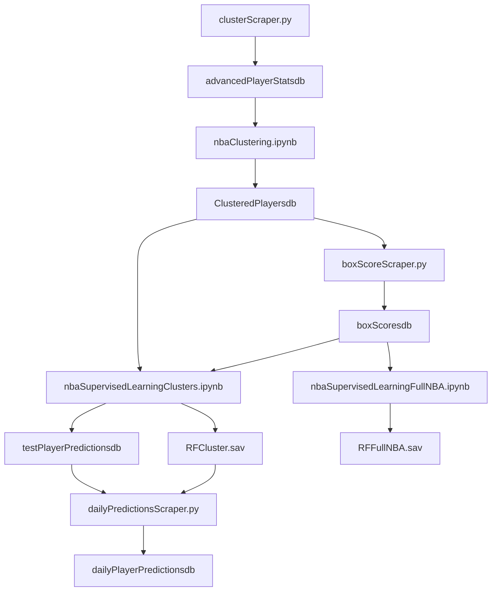

# **NBA_Machine_Learning**

## **Overview**
This repository contains work for a machine learning (ML) model designed to predict NBA player fantasy points.

## **Table of Contents**
- [Scripts](#scripts)
- [Postgres](#postgres)
- [Images](#images)
- [Models](#models)
- [Main](#main)
- [FlowChart](#flowchart)

---
## **Scripts**

- [unsupervisedLearningIntro.ipynb](#unsupervisedlearningintropynb)
- [clusterScraper.py](#clusterscraperpy)
- [nbaClustering.ipynb](#nbaclusteringipynb)
- [boxScoreScraper.py](#boxscorescraperpy)
- [nbaSupervisedLearningFullNBA.ipynb](#nbasupervisedlearningfullnbaipynb)
- [nbaSupervisedLearningClusters.ipynb](#nbasupervisedlearningclustersipynb)
- [dailyPredictionsScraper.py](#dailypredictionsscraperpy)

### **unsupervisedLearningIntro.ipynb:**
This notebook contains an introduction to unsupervised learning. It covers the KMeans algorithm and basic clustering. It has no relevance to the NBA beyond serving as an introduction to the techniques used in the project.

---

### **clusterScraper.py:**
This script scrapes https://www.nba.com/stats/players/advanced for various player statistics and stores them in a pandas DataFrame. No clustering occurs here; it is a data collection tool that gathers every player's statistics for a given season. This data is stored in PostgreSQL table **advancedPlayerStats** which serves as the primary point of reference for other tables. Info from this table is extracted into `nbaClustering.ipynb`, where player archetype clusters can be formed.

---

### **nbaClustering.ipynb:**
This notebook contains the code to cluster NBA players into archetypes. It uses the data collected by `clusterScraper.py` in PostgreSQL table **ClusteredPlayers** to form the player archetype clusters. 

#### **Clustering Methodology:**
- **PCA (Principal Component Analysis):** Dimensions are reduced to balance data representativeness (high variance ratio) and computational efficiency (low rate of change in the variance ratio using the elbow method).
- **Silhouette Score:** Used to evaluate clustering performance.
- **KMeans Algorithm:** Clusters are formed to correspond to player archetypes.

#### **Outputs:**
- Cluster assignments are stored in PostgreSQL table **advancedPlayerStats**.
- Visualizations are included in the `images` directory.
---

### **boxScoreScraper.py:**
This script scrapes the NBA website for all the box scores for each player in a given season. It stores the data in a pandas DataFrame and saves it to PostgreSQL table **boxScores**, along with some computations regarding fantasy points. This data is used in the Supervised Learning files.

---

### **nbaSupervisedLearningFullNBA.ipynb:**
This notebook applies Decision Tree and Random Forest algorithms to the entire NBA dataset, rather than a single player.

#### **Details:**
- **Training Dataset:** 75% of NBA player data.
- **Testing Dataset:** Remaining 25% of NBA player data
- **Evaluation Metric:** Mean error.

---

### **nbaSupervisedLearningClusters.ipynb:**
This notebook applies Decision Tree and Random Forest models to each cluster of players, calculated in the clustering step. Stored in the PostgreSQL table **testPlayerPredictions**.

#### **Details:**
- **Training Dataset:** 75% of NBA player data.
- **Testing Dataset:** Remaining 25% of NBA player data
- **Evaluation Metric:** Mean error.
- **Relevancy:** More accurate and relevant than the supervised learning without clusters. Therefore the model generated is being used in the following files.

---

### **dailyPredictionsScraper.py:**
This script scrapes https://www.dailyfantasyfuel.com/nba/projections/draftkings for the daily player matchups and stores them in a pandas DataFrame. It then uses the Random Forest model generated in `nbaSupervisedLearningClusters.ipynb` to predict the fantasy points for each player. The predictions are stored in PostgreSQL table **dailyPlayerPredictions**.

## **Postgres**
Database models and configuration for storing and querying NBA data.

---
### **config.py:**
This script contains the configuration settings for the PostgreSQL database. It should be used by all other scripts to connect to the database.

---
### **create_tables.py:**
This script will build all tables necessary for the project. It should be run before any other scripts outside of config to ensure the database is properly configured.

## **Images**
Visualizations explaining the project workflow and model details.

## **Models**
Serialized machine learning models (e.g., `.sav` files) for fantasy point predictions.

## **FlowChart**
A visual representation of the data pipeline and machine learning workflow.

## **Main**
`main.py` serves as the entry point for the project. Scripts will run in the order demonstrated in the flowchart.

---
# Thoughts on future work:
* TODO Matchup data: Home/Away, Opponent, injury reports, Rest, -- harder but usage rates depending on teammate availability.
* Take Salary into account
* Add data from prior year or two clealry marking the year, for clustering.
* Add confidence intervals

Cloud Migration:
* AWS Lambda for scraping scripts
* Amazon S3 for storing models and json data(let me know if you have something cheaper in mind)
* AWS RDS for backup
* Set up automated pipeline

Advice from friend with stats background:
Model notes:
* look into other regresssion models -- for now XGBoost but stepwise, lasso, and ridge down the line

For box score data:
* use time as x axis, and points on y axis, find trends for box score data; perhaps use this in addtion to FP
* Make sure R/W operations are efficient, especially for the box scores table, each time main.py runs
* Look into moving it to the cloud, that way web scraping can be automated and run on a schedule

