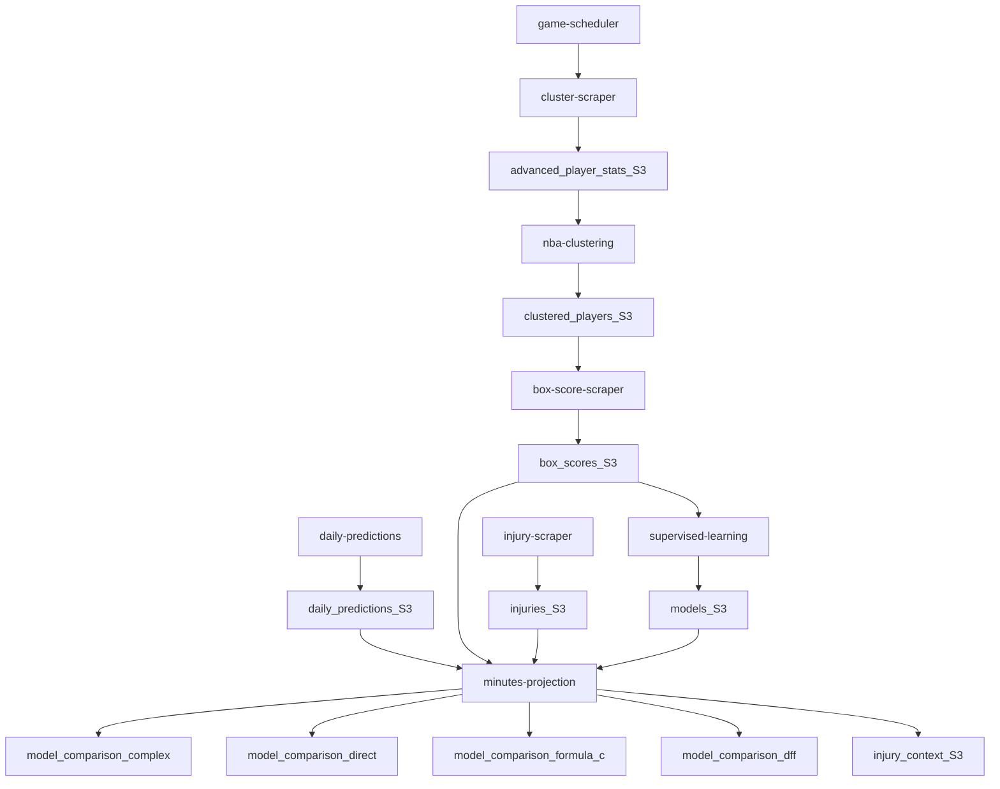

# NBA_Machine_Learning

## Overview
This repo is an AWS Lambda-based pipeline that scrapes NBA data, builds clustering + supervised-learning models, and generates DraftKings lineups and minutes projections. Data and models are stored in S3 as Parquet/PKL files (no Postgres in the current codebase).

## Key directories
- `lambda/`: All Lambda functions and per-Lambda `requirements.txt`/Dockerfiles.
- `scripts/`: Local notebooks and utilities (analysis, parsing, S3 inspection).
- `aws/`: Shared S3 utilities and inspection helpers.
- `frontend/`: Static UI for viewing lineups from the `lineup-optimizer` API.
- `documentation/`: Project docs (this file + `minutes-projection.md`).
- `images/`: Figures used in analysis and docs.

## Lambda pipeline (current code)
The `lambda/game-scheduler` Lambda scrapes the DailyFantasyFuel main slate start time and schedules these functions in sequence (2-minute offsets):
1. `cluster-scraper` -> `data/advanced_player_stats/current.parquet`
2. `nba-clustering` -> `data/clustered_players/current.parquet`
3. `box-score-scraper` -> `data/box_scores/{season}.parquet` and `data/box_scores/current.parquet`
4. `supervised-learning` -> `models/{current,fp_per_min,barebones}.pkl` and `models/*_feature_names.json`
5. `daily-predictions` -> `data/daily_predictions/current.parquet` (DFF projections only; no model FP here)
6. `injury-scraper` -> `data/injuries/current.parquet` (OUT-only from NBA PDF)
7. `minutes-projection` -> `model_comparison/*` (minutes + lineups) and `injury_context/*`

## What each Lambda does
- `cluster-scraper`: Pulls advanced/scoring/defense stats from the NBA API and writes `data/advanced_player_stats/current.parquet`.
- `nba-clustering`: Runs PCA + KMeans on multiple seasons of advanced stats and writes `data/clustered_players/current.parquet`.
- `box-score-scraper`: Pulls box scores from the NBA API, calculates DraftKings FP, adds rolling/career features, joins clusters, and writes seasonal + current Parquet files.
- `supervised-learning`: Trains three GradientBoosting FP models (`current`, `fp_per_min`, `barebones`) and saves models + feature lists to S3.
- `daily-predictions`: Scrapes DailyFantasyFuel projections and writes `data/daily_predictions/current.parquet` (PPG projection, salary, position, starter status).
- `injury-scraper`: Scrapes the official NBA injury report PDF and writes `data/injuries/current.parquet` with `OUT` players and estimated injury dates.
- `minutes-projection`: Generates minutes projections (complex overlap, direct position, formula C) + DFF baseline lineups, updates `PROJECTED_MIN` in daily predictions, writes lineups/minutes to `model_comparison/*`, and persists injury context.
- `lineup-optimizer` (standalone): A separate Lambda that optimizes a lineup from `daily_predictions` using `MY_MODEL_PREDICTED_FP`. It is not part of the game-scheduler pipeline.

## S3 schemas and inspection
- `s3_bucket_test_results.txt` is the authoritative schema snapshot for all S3 buckets.
- `scripts/test_s3_buckets.py` regenerates that file by inspecting bucket keys.

## Frontend
`frontend/index.html` is a lightweight viewer for the `lineup-optimizer` API (see `frontend/README.md`).

## Dependency constraints (Lambda)
Lambda runtimes must stay on NumPy 1.24.x-compatible wheels to avoid sklearn pickle issues.
Recommended pins for Lambda: numpy==1.24.3, scipy==1.11.4, pandas==2.1.3, scikit-learn==1.5.2.

## FlowChart (current pipeline)

