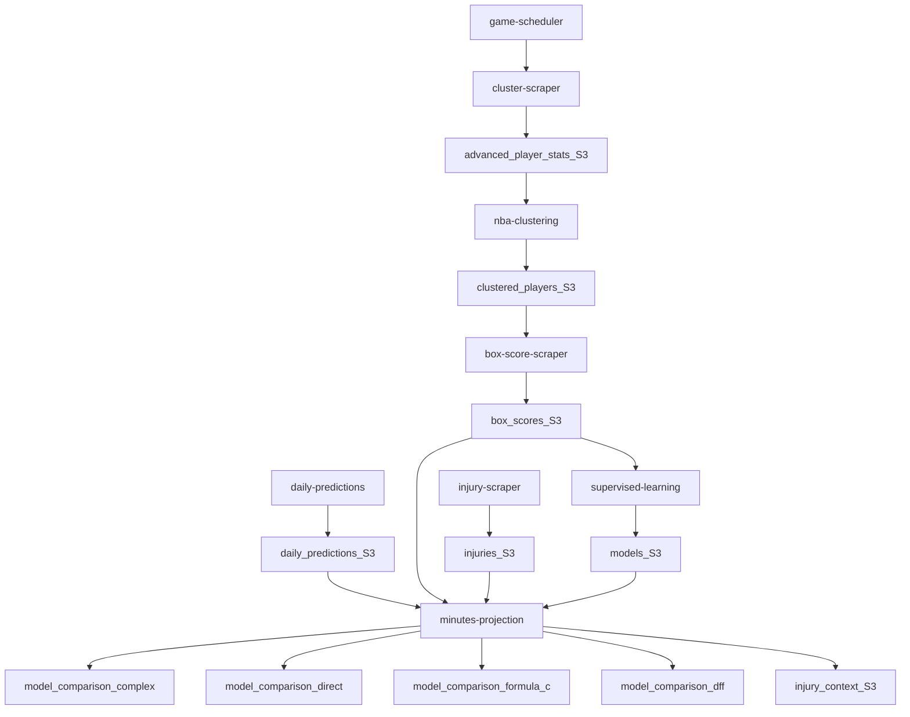

# NBA_Machine_Learning

## Overview
This repo is an AWS Lambda-based pipeline that scrapes NBA data, builds clustering + supervised-learning models, and generates DraftKings lineups and minutes projections. Data and models are stored in S3 as Parquet/PKL files (no Postgres in the current codebase).

## Key directories
- `lambda/`: All Lambda functions (one directory each with `lambda_function.py`, `requirements.txt`, `Dockerfile`) plus `deploy.py`.
- `scripts/`: Local utilities — model evaluation (`evaluate_projections.py`, `analyze_model_performance*.py`), S3 inspection, notebooks.
- `aws/`: Shared S3 utilities, inspection helpers, and the game-scheduler IAM policy document.
- `frontend/`: React + Vite viewer for the `lineup-optimizer` API (see `frontend/README.md`).
- `documentation/`: Project docs (this file + `minutes-projection.md`).
- `images/`: Figures used in analysis and docs.

## Lambda pipeline (current code)
The `lambda/game-scheduler` Lambda scrapes the DailyFantasyFuel main slate start time and schedules these functions in sequence (2-minute offsets):
1. `cluster-scraper` -> `data/advanced_player_stats/current.parquet`
2. `nba-clustering` -> `data/clustered_players/current.parquet`
3. `box-score-scraper` -> `data/box_scores/{season}.parquet` for the current and three prior seasons; the current season is mirrored to `data/box_scores/current.parquet`
4. `supervised-learning` -> `models/{current,fp_per_min,barebones}.pkl` and `models/*_feature_names.json`
5. `daily-predictions` -> `data/daily_predictions/current.parquet` (DFF projections only; no model FP here)
6. `injury-scraper` -> `data/injuries/current.parquet` (OUT-only from NBA PDF)
7. `minutes-projection` -> `model_comparison/*` (minutes + lineups) and `injury_context/*`

## What each Lambda does
- `cluster-scraper`: Pulls advanced/scoring/defense stats from the NBA API (via `PROXY_URL`) and writes `data/advanced_player_stats/current.parquet` plus a per-season copy (`{YYYY}-{YYYY+1}.parquet`).
- `nba-clustering`: Runs PCA + KMeans on multiple seasons of advanced stats and writes `data/clustered_players/current.parquet`.
- `box-score-scraper`: Pulls box scores from the NBA API, calculates DraftKings FP, adds rolling/career features, joins clusters, and writes seasonal + current Parquet files.
- `supervised-learning`: Trains three GradientBoosting FP models (`current`, `fp_per_min`, `barebones`) and saves models + feature lists to S3.
- `daily-predictions`: Scrapes DailyFantasyFuel projections and writes `data/daily_predictions/current.parquet` (PPG projection, salary, position, starter status).
- `injury-scraper`: Scrapes the official NBA injury report PDF and writes `data/injuries/current.parquet` with `OUT` players and estimated injury dates.
- `minutes-projection`: Generates minutes projections (complex overlap, direct position, formula C) + DFF baseline lineups, updates `PROJECTED_MIN` in daily predictions, writes lineups/minutes to `model_comparison/*`, and persists injury context.
- `lineup-optimizer` (standalone): A separate Lambda that optimizes a lineup from `daily_predictions` using `MY_MODEL_PREDICTED_FP`. It is not part of the game-scheduler pipeline.

## S3 schemas and inspection
- `s3_bucket_test_results.txt` is the authoritative schema snapshot for all S3 buckets.
- `scripts/test_s3_buckets.py` regenerates that file by inspecting bucket keys.

## Season handling
Every Lambda derives the current season from the date (July onward = new season) and reads the three prior seasons by name; nothing is hardcoded to a year. Injury reports come from `official.nba.com/nba-injury-report-{season}-season/` with a fallback to the prior season's page.

## Deployment
Docker Desktop must be running. `python lambda/deploy.py <function> [...]` or `--all` builds each image for `linux/amd64`, pushes it to ECR tagged with a UTC timestamp (and `:latest`), updates the function, and waits for it to become active. The AWS CLI is resolved from `.venv/Scripts/` if not on PATH. Functions are created once by hand; the script only updates code.

## Monitoring
Each Lambda raises on failure so the `AWS/Lambda Errors` metric fires. CloudWatch alarms `nba-lambda-errors-<function>` publish to the `lineup-optimizer-notifications` SNS topic (email). `game-scheduler` treats a missing DailyFantasyFuel slate as an error only between Oct 15 and Jun 25.

## Evaluation
`scripts/evaluate_projections.py` scores stored minutes projections and lineups against actuals, split by data-freshness regime (see the docstring for the 2025-26 regimes). Run it before judging any model change.

## Frontend
`frontend/` is a React + Vite app that reads the `lineup-optimizer` API (see `frontend/README.md`).

## Dependency constraints (Lambda)
Lambda runtimes must stay on NumPy 1.24.x-compatible wheels to avoid sklearn pickle issues.
Recommended pins for Lambda: numpy==1.24.3, scipy==1.11.4, pandas==2.1.3, scikit-learn==1.5.2.

## FlowChart (current pipeline)

```mermaid
graph TD;
    game-scheduler-->cluster-scraper;
    cluster-scraper-->advanced_player_stats_S3;
    advanced_player_stats_S3-->nba-clustering;
    nba-clustering-->clustered_players_S3;
    box-score-scraper-->box_scores_S3;
    clustered_players_S3-->box-score-scraper;
    box_scores_S3-->supervised-learning;
    supervised-learning-->models_S3;
    daily-predictions-->daily_predictions_S3;
    injury-scraper-->injuries_S3;

    daily_predictions_S3-->minutes-projection;
    box_scores_S3-->minutes-projection;
    injuries_S3-->minutes-projection;
    models_S3-->minutes-projection;

    minutes-projection-->model_comparison_complex;
    minutes-projection-->model_comparison_direct;
    minutes-projection-->model_comparison_formula_c;
    minutes-projection-->model_comparison_dff;
    minutes-projection-->injury_context_S3;
```
